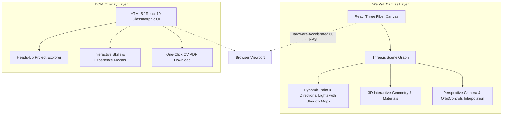

# 🌐 Muhammad Okasha — 3D Interactive Software Engineer Portfolio

<div align="center">

[](https://react.dev)
[](https://threejs.org)
[](https://r3f.docs.pmnd.rs)
[](https://vitejs.dev)
[](https://tailwindcss.com)
[](LICENSE)
[](https://github.com/muhammadokashapak)

<p align="center">
  <strong>Interactive 3D Web Experience Built with React 19, Three.js, React Three Fiber & Tailwind CSS Showcasing Advanced AI & Full-Stack Projects</strong>
</p>

[📖 Overview](#-overview) •
[🎨 3D Graphics & Aesthetics](#-3d-graphics--rendering-pipeline) •
[✨ Interactive Showcase](#-interactive-features) •
[📂 Directory Structure](#-directory-structure) •
[🚀 Quickstart](#-quickstart--deployment) •
[👨‍💻 Author](#-author--connect)

---

</div>

## 📖 Overview

Standard web portfolios featuring static cards and plain text fail to convey the creative engineering depth and technical capability of modern software architects.

This repository hosts the official **3D Interactive Developer Portfolio** of **Muhammad Okasha**, an AI Engineer and Full-Stack Architect. Built with cutting-edge **React 19**, **Three.js**, and **React Three Fiber (R3F)**, the portfolio integrates real-time WebGL rendering, 3D spatial models, interactive canvas lighting, smooth camera track transitions, and curated project showcases.

---

## 🎨 3D Graphics & Rendering Pipeline



---

## ✨ Interactive Features

- 🎮 **Real-Time 3D Spatial Canvas:** Hardware-accelerated 60 FPS WebGL rendering with smooth mouse-tracking inertia.
- 📱 **Fully Responsive Layout:** Automatically adjusts camera field-of-view and polygon density between desktop ultrawide and mobile touch screens.
- 💼 **Deep Project Case Studies:** Interactive showcases of enterprise healthcare ERPs, real-time voice AI agents, and computer vision systems.
- 📄 **Integrated Resume Download:** Direct access to Muhammad Okasha's official curriculum vitae and verified credentials.
- 🌙 **Curated Dark Aesthetic:** Harmonious dark-mode color palette, custom glowing borders, and modern typography.

---

## 📂 Directory Structure

```
Portfolio-3D/
│
├── src/
│   ├── components/            # 3D canvas objects, Hero, Navbar, Expertise, Projects
│   │   ├── Canvas.jsx         # R3F WebGL canvas setup & camera controls
│   │   ├── Expertise.jsx      # Technical skills matrix & engineering stack
│   │   ├── Hero.jsx           # Dynamic 3D hero introduction
│   │   └── Projects.jsx       # Interactive project showcases & external links
│   ├── assets/                # 3D assets, textures, and iconography
│   ├── App.jsx                # Main application component & layout
│   └── index.css              # Custom styling & Tailwind directives
├── public/                    # Static assets & favicon
├── Muhammad Okasha Resume.pdf # Official Curriculum Vitae
├── package.json               # React 19, Vite, Three.js, R3F dependencies
├── vite.config.js             # Vite 8 build & bundler configuration
└── README.md                  # VIP Master Architecture Documentation
```

---

## 🚀 Quickstart & Deployment

### 1. Clone & Install
```bash
git clone https://github.com/muhammadokashapak/Portfolio-3D.git
cd Portfolio-3D

npm install
```

### 2. Run Local Development Server
```bash
npm run dev
```
Open `http://localhost:5173` to explore the 3D portfolio experience!

### 3. Production Build
```bash
npm run build
npm run preview
```

---

## 👨‍💻 Author & Connect

**Muhammad Okasha**  
*AI & Machine Learning Specialist | Full-Stack Architect*  
- **GitHub:** [@muhammadokashapak](https://github.com/muhammadokashapak)
- **Portfolio:** [Muhammad Okasha 3D Portfolio](https://github.com/muhammadokashapak/Portfolio-3D)

---

## 📄 License
This project is licensed under the [MIT License](LICENSE).
